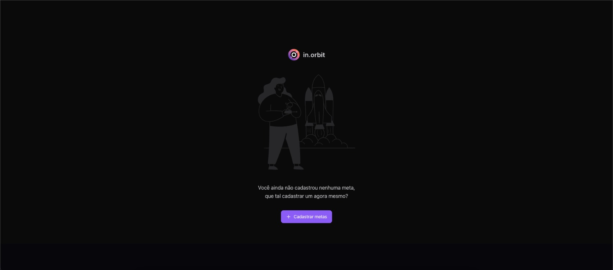
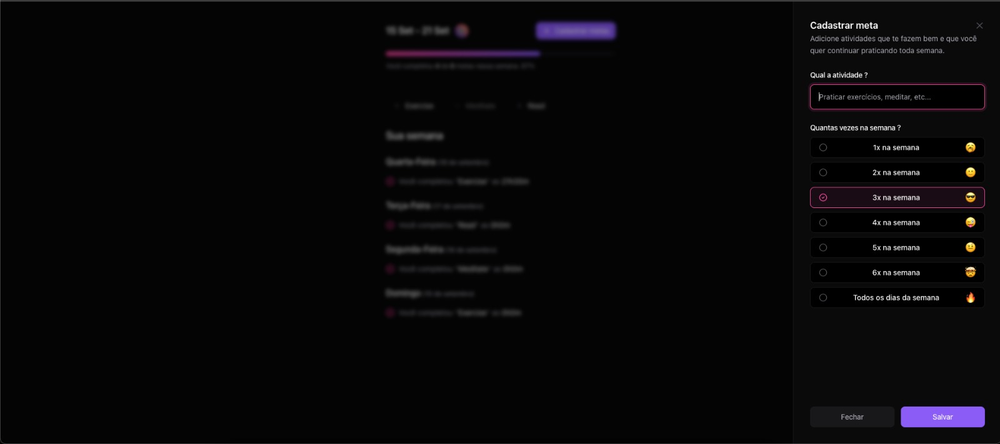
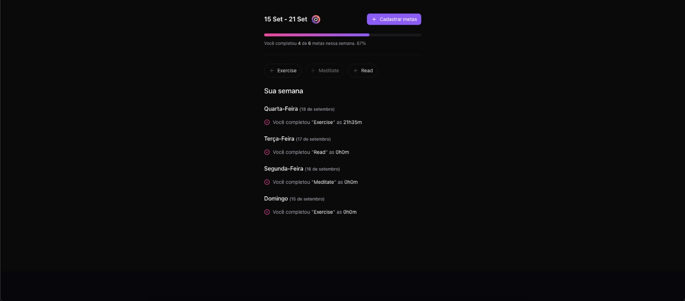

#   in.orbit
 in.orbit - Front-End

 # in.orbit - Front-End

Bem-vindo ao repositório do front-end do projeto **in.orbit**! Este projeto foi desenvolvido durante o evento **NLW Pocket** da Rocketseat e utiliza uma variedade de tecnologias modernas para criar uma interface rica e responsiva.

Você pode encontrar o back-end dessa aplicação em: https://github.com/Krollitte/in.orbit-server/

## Tecnologias Utilizadas

* **Vite**: Ferramenta de build rápida para desenvolvimento front-end.
* **React-Hook-Form**: Biblioteca para gerenciar formulários de forma simples e eficaz.
* **@tanstack/react-query**: Biblioteca para gerenciamento de dados e caching.
* **Tailwind CSS**: Framework utilitário para estilização rápida e responsiva.
* **Zod**: Biblioteca para validação de dados, utilizada tanto no front-end quanto no back-end.
* **Biome.js**: Alternativa ao ESLint para garantir a qualidade do código.

## Instalação e Configuração

1. Clone o repositório:
   ```bash
   git clone https://github.com/Krollitte/in.orbit-frontend.git
   ```
2. Instale as dependencias
  ```bash
  npm i
  ```

3. Inicie o servidor de desenvolvimento
  ```bash
  npm run dev
  ```

Estrutura do Projeto
A estrutura do projeto é organizada da seguinte forma:

```bash

src/
  assets/           # Arquivos estáticos como imagens e fontes
  components/       # Componentes React reutilizáveis
    ui/             # Componentes da interface do usuário
  http/             # Configurações e serviços HTTP
  app.tsx           # Componente principal do aplicativo
  index.css         # Arquivo de estilo global
  main.tsx          # Ponto de entrada do React
  vite-env.d.ts     # Declarações de tipo para o Vite
```

Fotos
Aqui estão algumas capturas de tela do aplicativo in.orbit:

Tela Inicial

<br/>
Cadastrar metas

<br/>
Dashboard Preenchido



### Contribuições
Contribuições são bem-vindas! Sinta-se à vontade para abrir issues ou pull requests.

Licença
Este projeto está licenciado sob a MIT License
